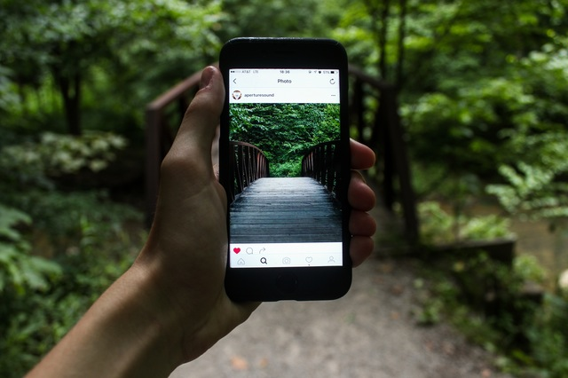
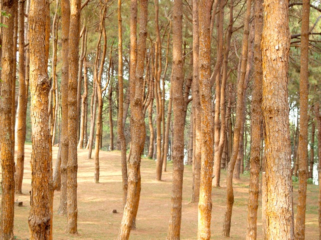
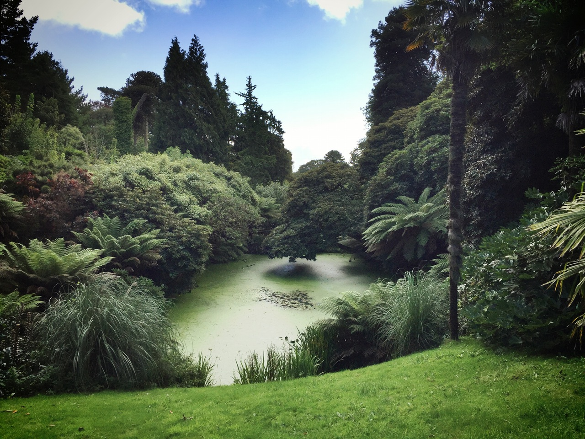

# Treekachu

[Blind man and armless friend plant trees in China](http://www.boredpanda.com/blind-man-amputee-plant-trees-china/)

An app to help tree planting. There's a lot of social and political demand for reforestation initiatives:

> China plans to plant 26 billion trees in the next decade that is two trees for every Chinese citizen per year.[24] China requires that students older than 11 years old plant one tree a year until their high school graduation. Trees for the Future has assisted more than 170,000 families, in 6,800 villages of Asia, Africa and the Americas, to plant over 35 million trees. Wangari Maathai, 2004 Nobel Peace Prize recipient, founded the Green Belt Movement which planted over 47 million trees to restore the Kenyan environment. Shanghai Roots & Shoots, a division of the Jane Goodall Institute, launched The Million Tree Project in Kulun Qi, Inner Mongolia to plant one million trees to stop desertification and alleviate global warming.[32][33]

https://en.wikipedia.org/wiki/Reforestation
https://en.wikipedia.org/wiki/Urban_reforestation

  

#Tree Planting App Idea Stress Tested:

- <a href="https://www.reddit.com/r/SomebodyMakeThis/comments/50lqav/smt_treekachu_a_pokemon_go_clone_for_treeplanting">Treekachu stress-tested on Reddit</a>

  

# Original Repo here: 

- <a href="https://github.com/VctrySam/Pokemon">Pokemon React Native Clone</a>

  

# Original Pokemon Clone Demo
https://youtu.be/RG6FFL2ny3s

  

#Original App Instructions
- Clone
- npm install in the terminal
- Run on IOS emulator or Android

  

#Reforestation Subreddit

https://www.reddit.com/r/Reforestation

    

Kaingaroa Forest is the largest forest in the North Island of New Zealand, and the largest plantation in the southern hemisphere.[citation needed]

The forest covers 2900 km² of the Bay of Plenty region, and stretches from Lake Taupo in the south to Kawerau to the north. The headquarters of the forest are at the small settlement of Kaingaroa, 50 kilometres southeast of Rotorua.[1] Prior to planting the area was a tussock and scrub plateau (ranging between 500 ft (150 m) and 2,481 ft (756 m) high), formed on volcanic ash.[2]

The forest was first planted in the late 1920s[3][4] and owned as a state asset by the New Zealand government.

